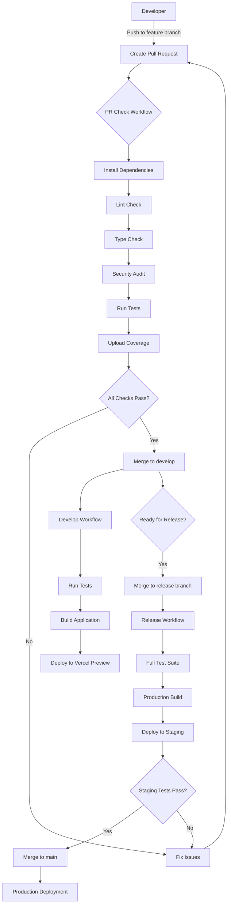

# CI/CD Pipeline Documentation

## Pipeline Overview

This document describes the CI/CD pipeline for the Plant Community React application.

## Pipeline Diagram

## Workflow Triggers

| Branch Pattern | Event | Workflow | Actions |
|---------------|-------|----------|---------|
| `feature/*` | Pull Request | PR Check | Lint, Type Check, Audit, Test |
| `develop` | Push | Develop Build | Test, Build, Preview Deploy |
| `release/*` | Push | Release Build | Full Test, Build, Staging Deploy |
| `main` | Merge | Production | Full Test, Build, Production Deploy |

## Workflow Files

### pr-check.yml
Location: `.github/workflows/pr-check.yml`

**Purpose**: Validate code quality on every pull request

**Steps**:
1. Install dependencies with `pnpm install --frozen-lockfile`
2. Run linting with `pnpm lint`
3. Run type checking with `pnpm type-check`
4. Run security audit with `pnpm audit`
5. Run tests with coverage `pnpm test:coverage`
6. Upload coverage report as artifact

## Environment Variables

See [SECRETS_MANAGEMENT.md](./SECRETS_MANAGEMENT.md) for details on managing secrets.

## Quality Gates

All workflows enforce the following quality gates:

- ✅ Zero linting errors
- ✅ Zero type errors
- ✅ No critical security vulnerabilities
- ✅ All tests passing
- ✅ Code coverage threshold met (when configured)

## Next Steps

- Phase 1: Add Vercel deployment integration
- Phase 2: Add Firebase deployment steps
- Phase 3: Add E2E testing with Playwright
